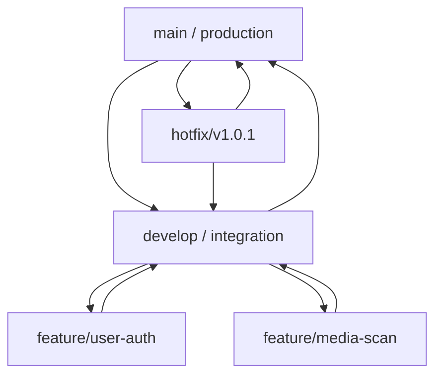

# Git Repository Branching & Workflow Standards

This document establishes the Git repository standards for the AI-powered Digital Media Verification System project. Following these guidelines ensures code quality, prevents branch conflicts, and maintains a clean commit history.

---

## 1. Branching Model (Git Flow Light)

We use a structured branching model to isolate development from production-ready code.

### Core Branches
* **`main`**: Reflects the production-ready state. Direct commits to `main` are strictly prohibited. All changes must arrive via approved Pull Requests (PRs) from `develop` or a `hotfix` branch.
* **`develop`**: The main integration branch. All feature branches are created from and merged back into `develop`.

### Supporting Branches
* **`feature/<name>`**: Used for implementing new features (e.g., `feature/flask-hardening`, `feature/test-suite`).
  * Source branch: `develop`
  * Merge target: `develop`
* **`bugfix/<name>`**: Used to fix bugs discovered during integration or QA cycles.
  * Source branch: `develop`
  * Merge target: `develop`
* **`hotfix/<name>`**: Used to fix critical production issues.
  * Source branch: `main`
  * Merge target: `main` and `develop`

---

## 2. Commit Message Convention

We follow the **Semantic Commit Messages** format. This makes the project history readable and allows for automated release note generation.

Format: `<type>(<scope>): <subject>`

### Types
* **`feat`**: A new feature (e.g., `feat(ui): add risk indicators on result page`)
* **`fix`**: A bug fix (e.g., `fix(routes): correct route name from predict to upload`)
* **`security`**: Security-related updates (e.g., `security(upload): implement MIME type magic byte verification`)
* **`test`**: Adding or modifying tests (e.g., `test(security): add test cases for file signature checking`)
* **`docs`**: Documentation updates (e.g., `docs(git): write git branching standards`)
* **`chore`**: Maintenance tasks, dependencies, refactoring (e.g., `chore(deps): pin package versions in requirements.txt`)

---

## 3. Pull Request (PR) Guidelines

Before merging any code from a feature branch to `develop`, the developer must ensure:

1. **Local Verification**: All unit tests must pass locally (`python -m unittest tests/test_app.py`).
2. **Review Checklist**:
   * No hardcoded credentials or API secrets.
   * Proper error handling for edge cases.
   * File uploads are sanitized using `secure_filename`.
3. **Approval**: At least one other team member must review and approve the PR.
4. **Merge Strategy**: Use **Squash and Merge** for feature branches to keep the `develop` history linear and clean.
